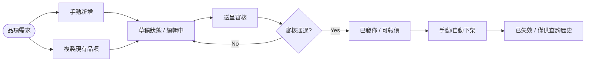

> Editor : VMFIVE Eunice
> 
> 
> Version : v1.0
> 
> Date : 2026.04.16
> 

---

完整列表清單：https://docs.google.com/spreadsheets/d/1p7-8I6tsz7-c3pV3ZVd3LNkg2CsXW8tCdfbljttQt90/edit?usp=sharing

---

## **1. 模組定位 (Module Positioning)**

本模組為 TopSale 系統的 **產品中心 (Product Catalog)**。旨在將全公司的「銷售單元」扁平化管理，提供報價單 (Quotation)、廣告投放 (Operation) 以及財務 (Finance) 一致性的品項定義。

**核心定位：定義銷售規格與價值，不儲存報價單交易資料。**

---

## **2. 資料模型 (Data Model - Master Catalog)**

本系統採用 **單一層級扁平主表**。不同「主代碼 (Main Category)」之品項共用基礎屬性，並根據類型填充其獨有的擴充欄位。

### **2.1 基礎通用欄位 (Common Attributes)**

所有品項（廣告、服務、專案）皆具備之基礎屬性。

| 欄位名稱 | Schema Key | 說明 |
| --- | --- | --- |
| **產品編號** | Product_ID | 新制結構化 ID，為全系統唯一識別碼 |
| **Ragic 編號** | Ragic_ID | 對應舊系統原始編號，供資料移轉對照 |
| **主代碼** | Main_Code | IAD (自營), ISY (系統), EXT (外媒), SVC (服務), PKG (專案) |
| **銷售子類別** | Sub_Category | PMP, PCN, Google, 口碑, 設計, 專案名稱等 |
| **Ratecard 排序** | Priority | 前台展示優先順序 |
| **計價單位** | Pricing_Unit | CPM, CPC, CPV, 案, 篇, 人, 每一尺寸等 |
| **單價** | Unit_Price | 銷售基數金額 |
| **生效/失效日** | Start/End_Date | 品項的銷售生命週期 |
| **狀態** | Status | 草稿, 已發佈, 已失效 |

### **2.2 廣告型擴充屬性 (Ad-specific - IAD/EXT/PCN)**

| 欄位類別 | 欄位名稱 | 說明 |
| --- | --- | --- |
| **規格** | **裝置/版位/格式/尺寸** | 中英文對照規格 |
|  | **素材形式** | 如：靜態 (Banner), 影音 (Video), 靜態+影音 (Banner+Video) |
| **成效** | **CTR / ER / VTR** | 預估廣告成效範圍 |
| **PMP 專屬** | **功能開關** | **僅限 PMP (IAD)**：Leading, Map, Weather, Stock, Count Down |
|  | **Leading CTR** | 當 Leading 啟用時的特定 CTR 範圍 |

### **2.3 專案型擴充屬性 (Package-specific - PKG)**

| 欄位名稱 | 說明 |
| --- | --- |
| **流量贈送** | 專案內含之免費曝光或流量額度 (Traffic Bonus) |
| **素材贈送** | 專案內含之設計或 Resize 贈送 (Creative Bonus) |
| **專案門檻** | 起報金額限制 (Threshold) |
| **限制條件** | 方案專屬之執行限制、簽回時效等條款 |
| **適用組合** | 定義該專案可選用之產品版位或特定格式 (Composition) |

### **2.4 服務型擴充屬性 (Service-specific - SVC)**

| 欄位名稱 | 說明 |
| --- | --- |
| **內容說明** | 詳細的勞務執行內容、修改次數上限等定義 |
| **商品備註** | 特殊註記資訊 |

---

## **3. 核心功能 (Functions)**

### **3.1 品項生命週期管理 (Life-cycle Management)**

- **草稿 (Draft)**: 新建品項之初始狀態，僅 PM 可見，不可用於報價。
- **發佈 (Publish)**: 發佈後業務端方可於報價單選購。
- **下架 (Inactive)**: 手動下架或日期過期。已下架品項保留歷史記錄，但不可新建報價。

### **3.2 複製功能 (Cloning & Templating)**

- 支援一鍵複製已存在品項，並自動繼承所有屬性至新草稿中，以利快速更新專案週期。

### **3.3 批量匯入/匯出 (Data Migration)**

- 對齊 CSV 目錄格式，支援分欄別 (IAD/SVC/PKG) 批量更新 Ratecard。

### **3.4 前後台架構 (System Architecture)**

- **後端管理介面 (Admin Backend)**：
    - **對象**：AM & PM & Admin。
    - **功能**：新增、編輯、複製、送審、發佈、下架所有產品、服務與專案。內含草稿夾。
- **前端業務介面 (Sales Frontend / Ratecard)**：
    - **對象**：Sales、廣告服團隊 (AS)。
    - **功能**：
        - **Ratecard 一覽表**：僅顯示「已發佈」且「未失效」的有效品項。
        - **即時過濾**：提供分組（類別、裝置、版位）搜尋與搜尋建議。
        - **資料來源**：此處為報價單選成品項的唯一法定資料源。

---

## **4. 作業流程 (Workflow)**

本模組旨在提供品項的完整維護循環，確保報價單引用之資料具備一致性與時效性。

### **4.1 品項維護循環 (Maintenance Circle)**

1. **建立與編輯 (Add / Clone / Edit)**:
    - **新增**: PM 手動錄入全新規格之品項，初始狀態為「草稿」。
    - **複製**: 從現用品項一鍵複製，系統自動生成新草稿，PM 僅需修改差異部分（如新專案年度）。
    - **修改**: 僅限於「草稿」狀態下進行細節調整。若為「已發佈」品項需修改，建議採「複製為新草稿後再發佈」之模式，以保護歷史訂單資料。
2. **稽核與發佈 (Review / Publish)**:
    - 由 AM/PM 完成品項內容錄入，並提交「送審」。
    - **主管進行審核**：檢核品項之編碼規則、單價及成效指標無誤。
    - 審核通過後方可執行「發佈」，品項狀態轉為「已發佈」。
    - 報價單模組即時同步，業務可開始選購該品項。
3. **上/下架與生命週期管理 (Shelf Management)**:
    - **手動下架**: 若該品項不再銷售，PM 可手動將狀態更換為「已下架」。
    - **自動失效**: 系統每日自動檢核，若當前日期超過「失效日 (End_Date)」，狀態自動轉為「已下架」。
4. **變動追蹤 (Audit)**:
    - 系統應記錄每次狀態變更與關鍵欄位（如單價）的修改記錄。

### **4.2 作業流程圖 (Process Flow)**

